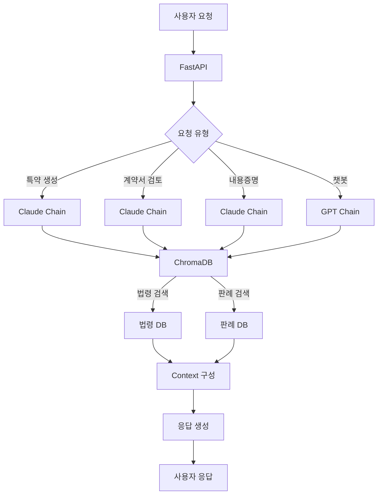

# SuperLawVA MLOps 🤖

<div align="center">
  
  
  **AI 기반 법률 지원 서비스를 위한 MLOps 시스템**
  
  
  
  
  
</div>

## 📋 목차

- [소개](#소개)
- [주요 기능](#주요-기능)
- [기술 스택](#기술-스택)
- [시스템 아키텍처](#시스템-아키텍처)
- [시작하기](#시작하기)
- [프로젝트 구조](#프로젝트-구조)
- [API 문서](#api-문서)
- [배포 가이드](#배포-가이드)
- [팀 소개](#팀-소개)

## 🤖 소개 및 ML 요약

SuperLawVA MLOps는 AI 기술을 활용한 법률 지원 서비스의 핵심 엔진입니다. LangChain과 FastAPI를 기반으로 구축된 이 시스템은 법률 문서 생성, 계약서 분석, 법률 상담 등 다양한 법률 서비스를 제공합니다.

---
### 🔧 주요 역할

- **주요 생성 기능 3가지 구현**
  - ✍️ 특약 생성
  - 🔍 계약서 검토
  - 📩 내용증명서 작성  
  → 모두 **Claude** 기반 생성 모델 사용

- **간단한 질의응답 챗봇 구현**  
  → **GPT** 기반으로 챗GPT 스타일 UI에 맞춘 대화형 설계

- **벡터DB 구축**
  - 판례 / 법령 데이터를 각각 **ChromaDB**에 저장
  - OpenAI `text-embedding-3-large` 임베딩 모델 사용

- **LangChain 기반 RAG 체인 구성**
  - 기능별로 Prompt, Retriever, Output Parser 등을 모듈화하여 설계

- **FastAPI 기반 ML API 서버 구축**
  - 백엔드와 완전 연동되는 REST API 제공

- **GitHub Actions 기반 CI/CD 자동화 파이프라인 구축**
  - 코드 Push 시 Docker Build → EC2 자동 배포

---

### 🧪 MLOps 기술 요약

| 항목               | 상세 내용                                  |
|--------------------|---------------------------------------------|
| 생성 모델           | **GPT (챗봇)** / **Claude (기능 3종)**        |
| 프레임워크          | FastAPI, LangChain                         |
| 임베딩 모델         | OpenAI `text-embedding-3-large`            |
| 벡터DB             | ChromaDB (법령 / 판례 분리 구축)           |
| 배포 방식           | Docker + AWS EC2                          |
| CI/CD 자동화 도구   | GitHub Actions                            |
| 문서 Chunking 방식  | RecursiveCharacterTextSplitter + 커스텀 필터링 |

---

### 💡 RAG 기반 처리 구조
```
[사용자 입력]
↓
[ChromaDB 검색 (법령 + 판례)]
↓
[관련 context 구성]
↓
[LLM에게 Prompt 전달]
↓
[문서 생성: GPT 또는 Claude]
```


## 주요 기능

### 📝 특약 생성

- AI 기반 맞춤형 계약 특약 조항 생성
- 법령 및 판례 기반 검증
- 다양한 계약 유형 지원

### 🔍 계약서 검토

- 자동 계약서 분석 및 리스크 평가
- 주요 조항 추출 및 설명
- 법적 위험 요소 식별

### 📨 내용증명 생성

- 상황별 맞춤형 내용증명서 작성
- 법적 효력을 고려한 문구 생성
- 다양한 템플릿 제공

### 💬 법률 상담 챗봇

- GPT 기반 실시간 법률 상담
- 판례 및 법령 기반 응답 생성
- 사용자 친화적 대화형 인터페이스

## 기술 스택

### 🛠 Core

- **Language**: Python 3.9+
- **Framework**: FastAPI
- **AI/ML**: LangChain, OpenAI GPT, Anthropic Claude
- **Vector DB**: ChromaDB

### 🔧 Infrastructure

- **Container**: Docker
- **Cloud**: AWS EC2
- **CI/CD**: GitHub Actions

### 📚 Data

- **Embedding**: OpenAI text-embedding-3-large
- **Storage**: ChromaDB (법령/판례 분리 구축)
- **Processing**: LangChain

## 시스템 아키텍처



## 시작하기

### 환경 설정

```bash
# 저장소 클론
git clone https://github.com/SuperLawVA/ml.git
cd ml

# 가상환경 생성 및 활성화
python -m venv venv
source venv/bin/activate  # Windows: venv\Scripts\activate

# 의존성 설치
pip install -r requirements.txt
```

### 환경 변수 설정

```bash
# .env 파일 생성
cp .env.example .env

# 필요한 환경 변수 설정
OPENAI_API_KEY=your-api-key
ANTHROPIC_API_KEY=your-api-key
```

### 개발 서버 실행

```bash
uvicorn main:app --reload
```

## 프로젝트 구조

```
ml/
├── src/
│   ├── routes/          # API 라우트
│   ├── services/        # 비즈니스 로직
│   │   ├── chains/     # LangChain 구성
│   │   └── schema/     # 데이터 모델
│   └── shared/         # 공통 유틸리티
├── dictionary/          # 법률 용어 사전
├── config.py           # 설정
└── main.py             # 앱 진입점
```

## API 문서

서버 실행 후 다음 URL에서 API 문서를 확인할 수 있습니다:

- Swagger UI: `http://localhost:8000/docs`
- ReDoc: `http://localhost:8000/redoc`

## 배포 가이드

### Docker 배포

```bash
# Docker 이미지 빌드
docker build -t superlawva-ml .

# 컨테이너 실행
docker run -d -p 8000:8000 superlawva-ml
```

### GitHub Actions CI/CD

- `main` 브랜치에 push 시 자동 배포
- Docker 이미지 빌드 및 AWS EC2 배포 자동화
- 상세 설정은 `.github/workflows/` 참조

## 팀 소개

SuperLawVA MLOps 팀은 AI와 법률의 결합을 통해 혁신적인 법률 서비스를 제공하기 위해 노력하고 있습니다.

## 라이선스

이 프로젝트는 MIT 라이선스를 따릅니다. 자세한 내용은 [LICENSE](LICENSE) 파일을 참조하세요.

---

<div align="center">
  Made with ❤️ by SuperLawVA Team
</div>
